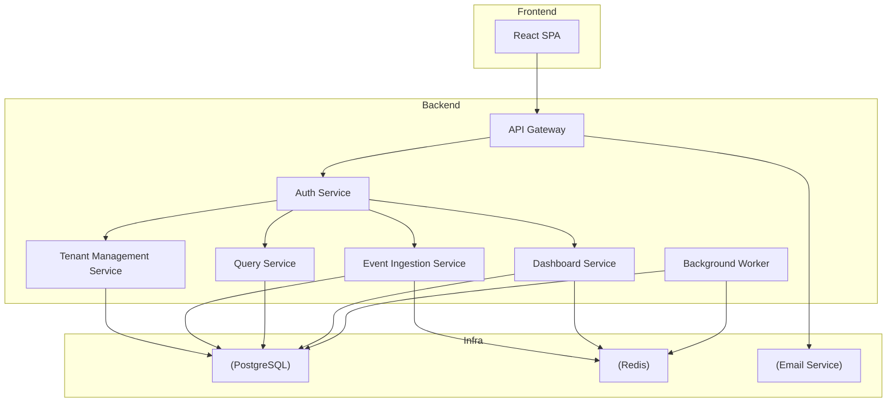

# Architect Mission Report

**Agent**: architect  
**Generated**: 2026-08-09T20:26:01.546Z

---

## Architecture Style

Modular Monolith (service‑oriented) deployed as independent containers

## Components

- **React SPA** (frontend): Single‑page application for dashboards, query builder and admin UI.
- **API Gateway** (backend): Entry point for all HTTP traffic; routes to internal services and handles rate‑limiting, request logging and CORS.
- **Auth Service** (backend): Issues JWTs, validates tokens, and enforces tenant‑scoped RBAC.
- **Tenant Management Service** (backend): Manages tenant accounts, user invitations, role assignments and API key lifecycle.
- **Event Ingestion Service** (backend): Validates incoming events, applies per‑tenant rate limits, writes raw events to the store and pushes a lightweight job to the background worker for aggregation.
- **Query Service** (backend): Executes ad‑hoc aggregation queries over the event store, returns results for charts/tables.
- **Dashboard Service** (backend): CRUD for dashboards, charts, saved queries and sharing links within a tenant.
- **Background Worker** (backend): Processes aggregation jobs (e.g., daily roll‑ups for pre‑built dashboards) and updates materialized views.
- **PostgreSQL** (database): Primary relational store for tenants, users, API keys, raw events, materialized views and dashboard metadata.
- **Redis** (cache / queue): In‑memory cache for rate‑limit counters, session data and job queue for the background worker.
- **Email Service** (external integration): Sends invitation, password‑reset and API‑key notification emails.

## Tech Stack

- **Frontend**: React 18 with TypeScript and Vite — React has the largest talent pool and ecosystem for building data‑heavy SPAs. Vite gives fast dev server start‑up and HMR. Angular adds unnecessary complexity for a dashboard‑centric UI, while Vue is comparable but has a smaller pool of senior developers in most SaaS teams.
- **API Gateway / HTTP Server**: Node.js 20 + Express.js — Express is battle‑tested, easy to extend with middleware for auth, rate limiting and logging. Fastify offers better performance but the marginal gain is not needed for the initial traffic volume. Go would require a separate language stack, increasing hiring friction.
- **Auth & RBAC**: Passport‑JWT (Node.js) — Passport‑JWT provides lightweight JWT handling with no external dependency, fitting the simple role model. Auth0 adds recurring SaaS cost and external trust; Keycloak is heavyweight for a system that only needs two roles per tenant.
- **Database**: PostgreSQL 15 — PostgreSQL offers strong relational capabilities, JSONB for flexible event properties, and built‑in materialized views for pre‑built dashboard aggregates. MySQL lacks the same level of JSON querying performance, and MongoDB would complicate joins needed for tenant isolation and user management.
- **Cache / Queue**: Redis 7 (used for rate‑limit counters, session cache, and BullMQ job queue) — Redis provides both fast in‑memory caching and reliable queue semantics via BullMQ, covering two needs with one service. Memcached cannot act as a durable queue, and RabbitMQ adds operational overhead for a use‑case that fits Redis well.
- **Background Processing**: BullMQ (Redis‑based job queue) running in a Node.js worker process — BullMQ integrates directly with the existing Redis instance, keeping the stack homogeneous and simplifying deployment. Sidekiq would require a Ruby runtime, and SQS + Lambda introduces external cloud‑specific services that increase cost and latency for low‑volume batch jobs.
- **Email Integration**: SendGrid API — SendGrid offers generous free tier, easy SMTP/HTTP API, and good deliverability. Amazon SES is cheaper but requires AWS account setup and IAM management; Mailgun is comparable but SendGrid has broader SDK support for Node.js.
- **Containerization / Orchestration**: Docker Compose for local dev and single‑node Docker deployment to production — The projected load (few million events/month) can be handled by a single VM; Docker Compose provides simple reproducible environments without the operational burden of Kubernetes. Swarm is deprecated, and Kubernetes would be over‑engineering at v1.
- **Testing**: Jest for unit tests, SuperTest for API integration, Cypress for end‑to‑end UI tests — Jest is the de‑facto standard for JavaScript/TypeScript testing with built‑in mocking and coverage. SuperTest pairs naturally with Express. Cypress offers a developer‑friendly UI testing experience; Playwright is comparable but Cypress has tighter integration with React component testing.
- **CI/CD**: GitHub Actions building Docker images and pushing to GitHub Container Registry — GitHub Actions is native to the repository host, free for public/private projects up to generous limits, and can orchestrate Docker builds, linting, and test suites without extra cost. GitLab CI would require a separate platform; CircleCI adds another SaaS subscription.
- **Observability**: OpenTelemetry SDK (Node) + Prometheus + Grafana — OpenTelemetry is vendor‑agnostic and integrates with Prometheus, which can be self‑hosted at low cost. Datadog/New Relic are powerful but introduce recurring SaaS fees and vendor lock‑in for a startup MVP.

## Epics

- **E1** Tenant & User Management: Enable tenant sign‑up, admin invitation flow, role assignment, and user authentication.
- **E2** API Key Generation & Event Ingestion: Admins can create/revoke per‑tenant API keys; external clients post events via a rate‑limited, validated endpoint.
- **E3** Pre‑Built Dashboard Views: Provide out‑of‑the‑box charts (event volume, active users, top events) that refresh from materialized aggregates.
- **E4** Ad‑Hoc Query Builder: Allow members to construct custom queries (filter by event name, properties, time range, aggregation) and visualize results.
- **E5** Dashboard Saving & In‑Tenant Sharing: Users can save charts to dashboards and generate read‑only share links scoped to the same tenant.
- **E6** Rate Limiting & Security Hardening: Enforce per‑API‑key request quotas, validate payloads, and ensure tenant data isolation at the DB layer.
- **E7** Observability & Alerting: Instrument all services with metrics, logs and traces; set up dashboards for latency, error rates and queue depth.

## Architecture Diagram

