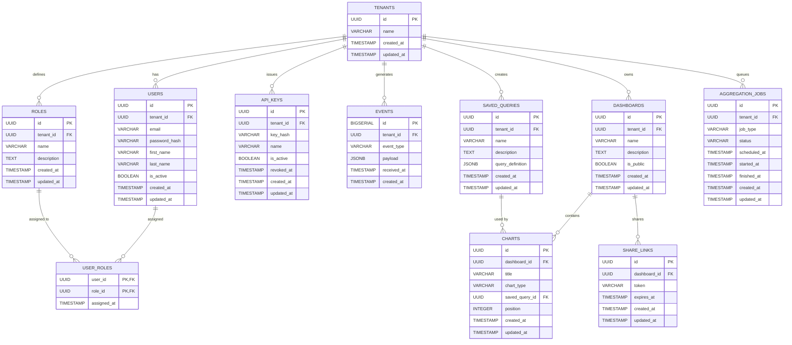

# DBA Mission Report

**Agent**: dba  
**Generated**: 2026-08-09T20:27:12.874Z

---

## Database Engine: PostgreSQL 15

PostgreSQL provides strong relational capabilities, native JSONB support for flexible event payloads, built‑in materialized views for pre‑aggregations, and robust ACID guarantees needed for multi‑tenant isolation. It aligns with the tech stack decision and supports horizontal scaling via read replicas when needed.

## Entities (11)

- **tenants**: 4 columns
- **users**: 9 columns
- **roles**: 6 columns
- **user_roles**: 4 columns
- **api_keys**: 8 columns
- **events**: 6 columns
- **aggregation_jobs**: 9 columns
- **dashboards**: 7 columns
- **saved_queries**: 7 columns
- **charts**: 8 columns
- **share_links**: 6 columns

## ERD

