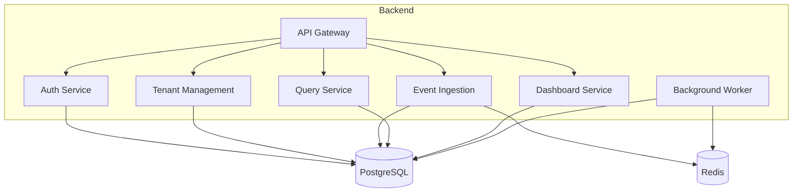

# Senior Backend Developer Mission Report

**Agent**: senior-backend  
**Generated**: 2026-08-09T20:31:00.818Z

---

## Branch: multitenantsaas3/chore/scaffold

## Files Changed

- **created** `docker-compose.yml` — Added Docker Compose configuration defining all services (API Gateway, Auth, Tenant Management, Event Ingestion, Query, Dashboard, Background Worker, PostgreSQL, Redis) with networking, environment variables, and volume mounts.
- **created** `db/init.sql` — Created PostgreSQL schema script with tables for tenants, users, roles, user_roles, api_keys, events, aggregation_jobs, dashboards, saved_queries, charts, and share_links, plus indexes and UUID extension.

## Notes

Docker Compose sets up a backend network, maps ports for API Gateway (8080), PostgreSQL (5432), and Redis (6379). Each service builds from its own directory. The init.sql script is mounted into the Postgres container to initialize the schema on startup.

## Diagram

